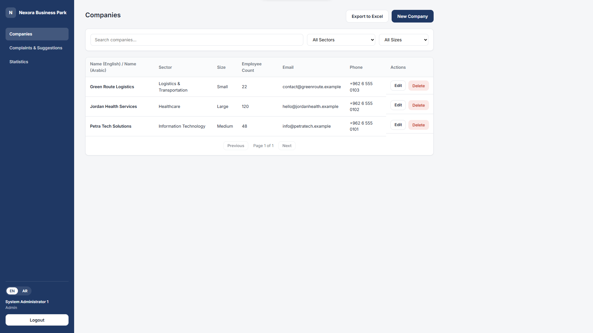
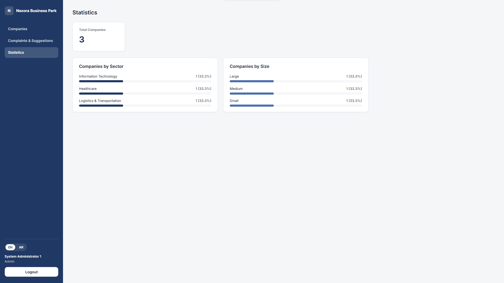
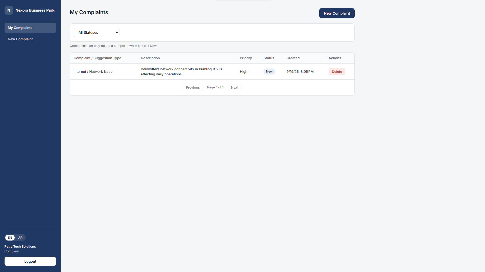
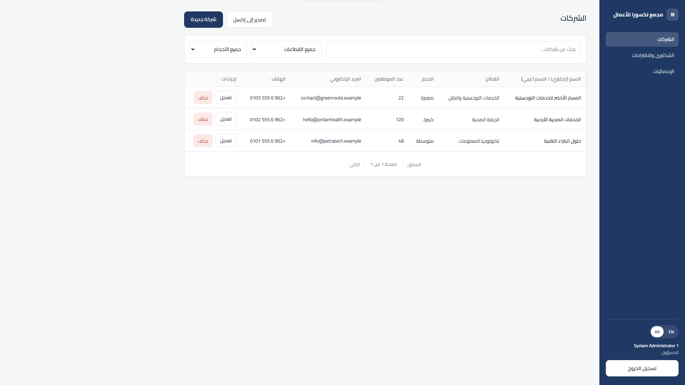

# Business Park Management System

A bilingual full-stack application for managing business-park companies, complaints, administrator access, and operational reports.

## Screenshots

### Company Directory



### Statistics Dashboard



### Complaint Management



### Arabic Interface



## Highlights

- Administrator and company authentication with JWT
- Company onboarding, updates, status control, and credential management
- Complaint creation and tracking
- Dashboard statistics and Excel exports
- English and Arabic interface with right-to-left support
- Angular unit tests and environment-specific API configuration
- Seed credentials and signing keys kept outside source control

## Technology

- ASP.NET Core 10 Web API
- Entity Framework Core 10 and SQL Server
- Angular 22, TypeScript, RxJS, and Vitest
- ClosedXML for Excel export

## Project structure

- `API/BusinessParkCompaniesManagement.Server` — Web API, EF Core migrations, and business services
- `UI/BusinessParkCompaniesManagement.Client` — Angular client

## Local setup

Prerequisites: .NET 10 SDK, SQL Server, Node.js, and npm.

1. Open a terminal in the API directory:

   ```powershell
   cd API\BusinessParkCompaniesManagement.Server
   dotnet restore
   dotnet user-secrets set "Jwt:Key" "replace-with-a-random-secret-that-is-at-least-32-characters"
   dotnet user-secrets set "SeedAdmin:Password" "choose-a-local-admin-password"
   dotnet run --launch-profile https
   ```

   The API applies its existing migrations and seeds two administrators when the database is empty. The local connection string targets `BusinessParkDb` on SQL Server. Change `ConnectionStrings:DefaultConnection` with user-secrets if your SQL Server setup differs.

2. In a second terminal, start the Angular client:

   ```powershell
   cd UI\BusinessParkCompaniesManagement.Client
   npm ci
   npm start
   ```

3. Open `http://localhost:4200`. The development client calls `https://localhost:7153/api`.

The seeded usernames are `admin1` and `admin2`; both use the password you placed in `SeedAdmin:Password`.

## Validation commands

```powershell
cd API\BusinessParkCompaniesManagement.Server
dotnet build

cd ..\..\UI\BusinessParkCompaniesManagement.Client
npm ci
npm test -- --watch=false
npm run build
```

Swagger is available at `https://localhost:7153/swagger` in Development. Example requests are in `BusinessParkCompaniesManagement.Server.http`.

## Security notes

Do not commit a real JWT key, administrator password, production connection string, or generated user-secret files. Production deployments should use a managed secret store, HTTPS, a restricted CORS origin list, and a dedicated database identity with minimum permissions.
